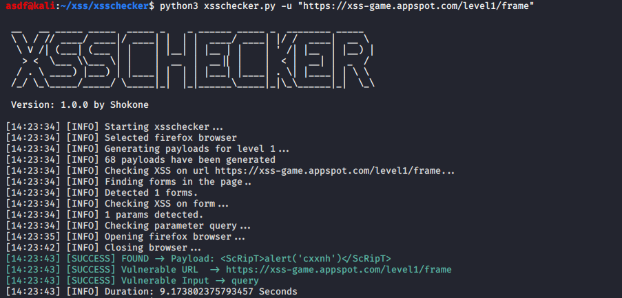
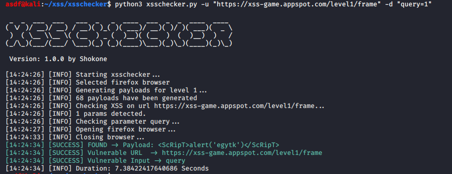

# XSSChecker

XSSChecker is an advanced XSS detection suite.

## Install

### Requirements
Python 3.7 or above

### Install
Execute `pip3 install -r requirements.txt`

### Usage

```shell
python3 xsschecker.py -h
```

```shell
usage: xsschecker.py [-h] [-V] [-v] [-u URL] [-m METHOD] [-c COOKIE]
                     [-p PARAMETER] [-d DATA] [--user-agent USERAGENT]
                     [-l LEVEL] [--payload PAYLOAD] [--show-browser]
                     [--no-check-browser] [--browser SELECT_BROWSER]

optional arguments:
  -h, --help            show this help message and exit
  -V, --version         Show version number and exit.
  -v, --verbose         Increase output verbosity

Target:
  It is mandatory to specify a target on which to carry out the testing

  -u URL, --url URL     Target URL. example: "http://example.com/index.php"

Request:
  Use this options to specify how to connect to the target

  -m METHOD, --method METHOD
                        Force usage of given HTTP method (GET, POST...). By
                        default GET.
  -c COOKIE, --cookie COOKIE
                        Cookie header value.
  -p PARAMETER, --parameter PARAMETER
                        Type only one parameter name to check
  -d DATA, --data DATA  Data string to be sent. If you don\'t specify, the
                        script will search for possible forms. Example:
                        "username=admin&pass=admin"
  --user-agent USERAGENT
                        User-Agent header value

Detection:
  Use this options to check if target is vulnerable to XSS

  -l LEVEL, --level LEVEL
                        Level of tests to perform ( values 1-3, default 1 )
                        Use only with default payloads.

Injection:
  These parameters can be used to specify custom payloads or another
  specific parameters to test.

  --payload PAYLOAD     Custom payloads file. 

Customize:
  Use this options to customize your testing

  --show-browser        By default browser is run in background. Add this
                        option to show it.
  --no-check-browser    By default use firefox to check XSS. Add this
                        parameter to avoid it
  --browser SELECT_BROWSER
                        Select browser to check XSS (firefox or chrome). By
                        default use firefox.

```

# Basic Mode
Add only url without params. The script search forms automatically and test if the inputs are vulnerable to XSS.


# Advanced Mode
Add your own parameters, cookies, user-agent...


# Browser
By default check XSS by simple request and test with a browser (firefox or chrome) to verify that request opens a successful alert on the target.
- Firefox -> https://github.com/mozilla/geckodriver/releases
- Chrome  -> https://chromedriver.chromium.org/downloads

# Payloads
The script uses 3 different payload levels
- Level 1 - Basic XSS
- Level 2 - Basic XSS, body, img and div
- Level 3 - Basic XSS, body, img, div, svg and polyglot

If use your own payloads file, add text INJECTHERE to use with this tool.
The script replaces the text INJECTHERE with an integer value or random string for confirmation.
If you have any questions, you can check the template located at data/payload_template.txt